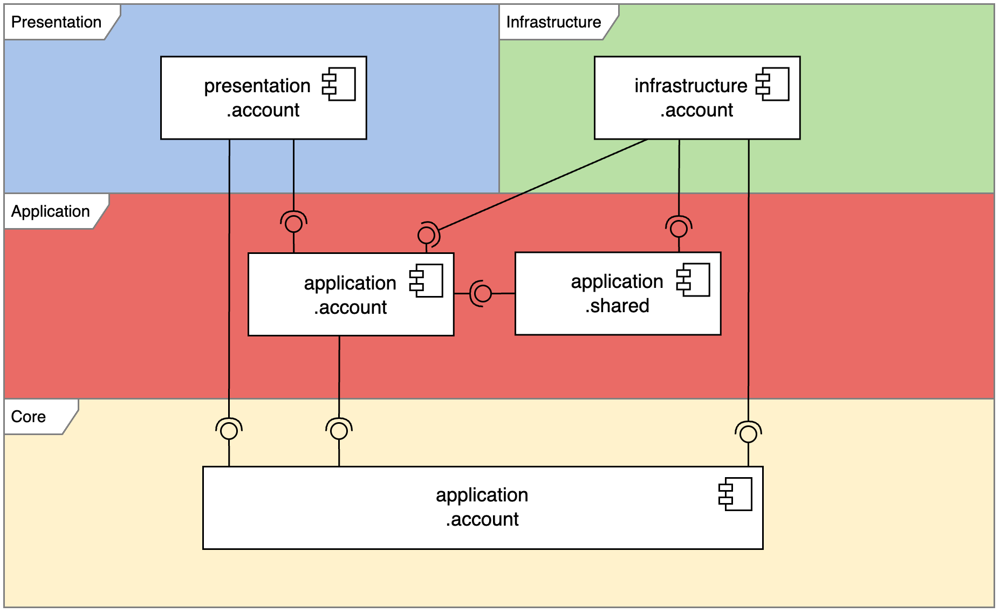

# Modular Parking Management System

The Modular Parking Management System is a **backend prototype** for efficient parking space management. Built with the Java Platform Module System (JPMS), Maven and Spring, it uses Clean Architecture and strong modular boundaries for maintainability and testability.

- Modular design with strict separation of concerns
- RESTful API for bookings and parking management
- User authentication and access control

This project demonstrates modern, maintainable backend architecture for academic purposes.

---

## Table of Contents
- [Clean Architecture](#clean-architecture)
- [Modules](#modules)
- [Repository Injection](#repository-injection)
- [Flow of Requests](#flow-of-requests)
- [Spring Configuration Injection](#spring-configuration-injection)
- [The Database](#the-database)
- [License](#license)

## Clean Architecture
The prototype adheres to Clean Architecture principles, ensuring that business logic is decoupled from frameworks and external systems. This promotes testability and maintainability.

## Modules
Each feature is encapsulated in its own modules, with clear boundaries and dependencies. This modular approach allows for independent development, testing, and deployment of features.

*Modules for the account feature; other features follow the same or similar structure.*

## Repository Injection
Due to the modular design adherent to Clean Architecture, repositories can be injected without tight coupling. This is achieved through interfaces and dependency inversion.

## Flow of Requests

## Spring Configuration Injection
Each module provides its own Spring configuration class to manage beans and dependencies. JPMS makes the configuration class visible to the system. The Service Provider Interface (SPI) loads the configuration class at runtime, making the module's beans available to Spring and enabling module injection.

## The Database
DB entities and their relationships.

---

## License

This project is for academic purposes only and must not be used, copied or distributed by others for any purpose.
